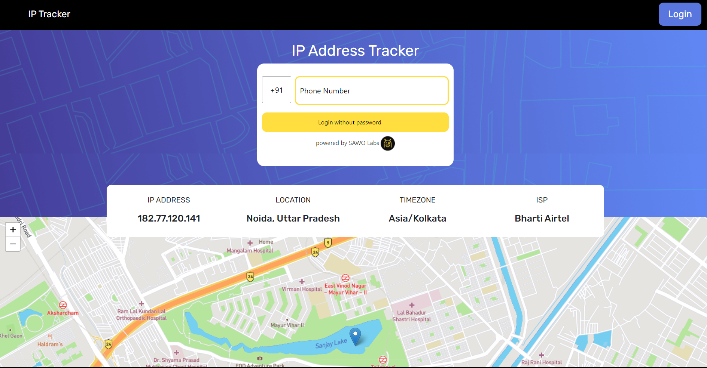

# IP Address Tracker

## Table of contents

- [Overview](#overview)
  - [The challenge](#the-challenge)
  - [Screenshot](#screenshot)
  - [Links](#links)
  - [My process](#my-process)
  - [Built with](#built-with)

## Overview
#### A simple flask application for IP Address Tracking and plotting on an interactive map

### The challenge

Users should be able to:

- Login using SAWO sdk (the passwordless way)
- View the optimal layout for each page depending on their device's screen size
- See hover states for all interactive elements on the page
- See their own IP address on the map on the initial page load
- Search for any IP addresses or domains and see the key information and location

### Screenshot

### Links

- Solution URL: [Add solution URL here](https://your-solution-url.com)
- Live Site URL: [Add live site URL here](https://your-live-site-url.com)

## My process

### Built with

- Semantic HTML5 markup
- CSS custom properties
- Flexbox
- CSS Grid
- JavaScript
- Flask
- Sawo Authentication
- [IP Geolocation API by IPify](https://geo.ipify.org/)
- [LeafletJS](https://leafletjs.com/)

